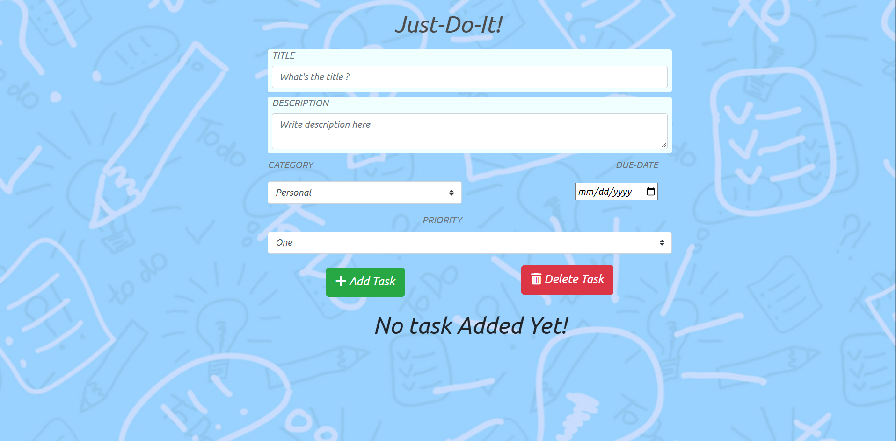

# TODO APP

A simple Todo Web App made using Express , MongoDB and Node.js

# How to use

1. Get NodeJs on your System.
2. Clone this repository .
3. Open in terminal/cmd
4. Do npm install
5. Go to Web Browser and hit https://localhost:8000

# Specifications

1. You can add task (with priority ,due-date and category tags) 
2. All the Tasks are stored and fetched from MongoDB 
3. You can delete single/multiple tasks by selecting them via chekboxes 

# FrameWorks and Database Used 

1. Node Js
2. Express
3. MongoDB
4. Bootstrap

# Screenshots
1. The Start App 

2. Added Tasks Lists

3. Deleted Task 2

